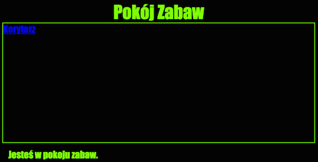

--- challenge ---

## Wyzwanie: Dodaj styl i podlinkuj Pokój Zabaw

Zmień kod HTML i CSS **Pokoju Zabaw** w taki sposób, by strona wyglądała tak:

Wskazówka: Musisz zmienić kolor tła, czcionki i ramki w pliku `gamesroom.css`. Jasnozielony kolor nazywa się `chartreuse`.

Wskazówka: musisz dodać link `<a>` w pliku `gamesroom.html`, który będzie odnośnikiem do `index.html`.

--- /challenge ---