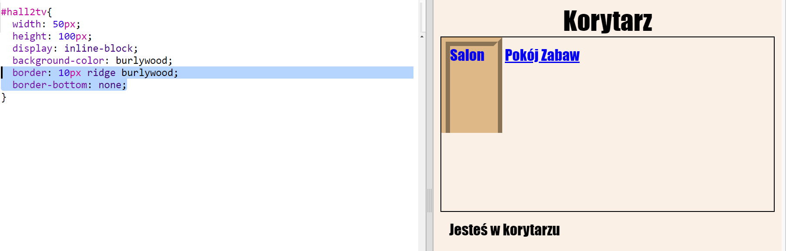

## Spraw, żeby linki wyglądały jak drzwi

Linki nie muszą być zwykłym tekstem. Stwórzmy drzwi które można kliknąć używając tagu `
`.

+ Otwórz `index.html` i dodaj tag `
`wokół tekstu **Salon**. Tag ten powinien znaleźć się wewnątrz `<a>`, aby można go było kliknąć.
    
    Dodaj `id="hall2tv"`, aby oznaczyć link jako drzwi z korytarza do salonu i móc dodać im styl.
    
    

+ Teraz kliknij na zakładkę `style.css` i dodaj poniższy kod CSS, aby zmienić rozmiar i kolor drzwi:
    
    

+ Przetestuj swoją stronę klikając drzwi w różnych miejscach, nie tylko w tekst.

+ Zmieńmy je tak, by wyglądały trochę bardziej jak drzwi. W tym celu dodamy ramkę z trzech stron:
    
    

+ Dodajmy też trochę kodu CSS, aby tekst na drzwiach wyglądał nieco lepiej:
    
    

+ Pewnie zauważyłeś, że drzwi wiszą w powietrzu. Naprawmy to ustawiając je w odpowiednim miejscu.
    
    

+ Przetestuj swoją stronę klikając drzwi do **Salonu**.