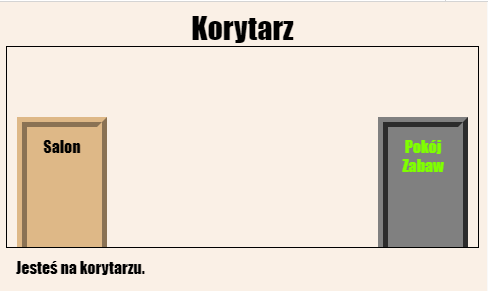
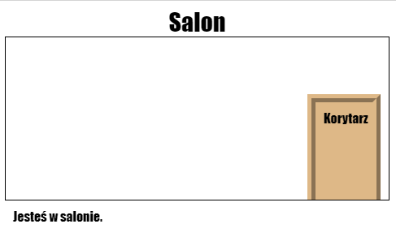

\--- challenge \---

## Wyzwanie: Jeszcze więcej drzwi!

Zamień pozostałe linki w projekcie w taki sam sposób - zrób z nich drzwi.

Dla każdych drzwi musisz:

+ Edytuj link - drzwi, używając `
`z identyfikatorem (np. `kor_zab`), aby móc go ostylować.
    
    Na przykład:
    
    `<a href="gamesroom.html">
Games Room
</a>`

+ Dodaj CSS dla identyfikatora drzwi w pliku `.css` dla tego pokoju. Użyj*kopiuj* i *wklej* aby oszczędzić czas. Jeśli chcesz, możesz nadać każdym drzwiom indywidualny wygląd.

+ Ustaw drzwi w odpowiednim miejscu, używając `bottom:` (od dołu) oraz `left:` (od lewej) lub `right:` (od prawej).

Korytarz może wyglądać tak:

Salon powinien wygladać mniej więcej tak:

\--- /challenge \---