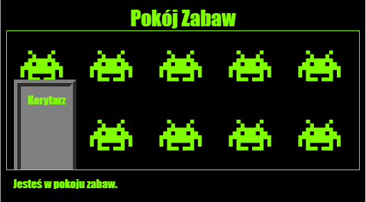

--- challenge ---

## Wyzwanie: Dodaj tapetę do Pokoju Zabaw

Czy potrafisz udekorować pokój zabaw dodając obrazek jako tło?

Możesz użyć tapety z pliku `space-invader.png` który jest zawarty w Twoim projekcie.

Będziesz musiał:

+ Dodać `background-image:` do CSS `.room` dla Pokoju Zabaw. 

Udekorowany pokój powinien wyglądać mniej więcej tak:

--- /challenge ---