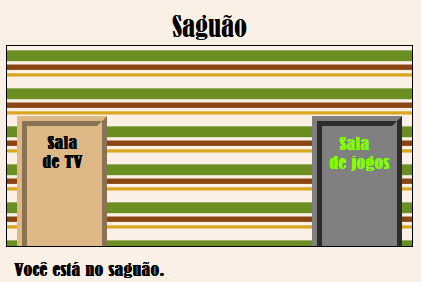

## Introdução

Neste projeto, você criará um conjunto de cômodos interligados no qual cada cômodo é uma página web diferente que pode ser decorada usando HTML.

  <iframe src="https://trinket.io/embed/html/eab49f4f06?outputOnly=true&start=result" width="600" height="450" frameborder="0" marginwidth="0" marginheight="0" allowfullscreen>
  </iframe>
  

**Instruções**: Clique nas portas para se mover pelos cômodos.

### Informação adicional para líderes de clubes

Se você precisar imprimir este projeto, use a [Versão para Impressão](https://projects.raspberrypi.org/en/projects/linked-rooms/print).

## \--- collapse \---

## title: Notas do líder do clube

## Introdução:

Neste projeto, crianças são apresentadas a várias páginas da Web vinculadas no mesmo projeto cada uma com seu próprio arquivo CSS.

## Recursos Online

Nós recomendamos usar [trinket](https://trinket.io/) para escrever HTML & CSS online. Este projeto contém o seguinte trinket:

* ['Cômodos conectados' ponto de partida -- jumpto.cc/web-rooms](https://trinket.io/html/f1486ddb24)

Crianças também podem usar este trinket em branco [(jumpto.cc/html-blank)](http://jumpto.cc/html-blank) para escrever seu próprio HTML & CSS, ou alternativamente eles podem usar este modelo de trinket [(jumpto.cc/html-template)](http://jumpto.cc/html-template).

Há também um trinket contendo um exemplo de solução para os desafios:

* ['Cômodos Conectados Terminado' -- https://trinket.io/html/ba5d27ec68](https://trinket.io/html/eab49f4f06)

## Recursos Offline

Este projeto pode ser [concluído offline](https://www.codeclubprojects.org/en-GB/resources/webdev-working-offline/) se você preferir. Você pode acessar os recursos disponíveis clicando no link 'Materiais do Projeto'. Este link contém uma seção "Recursos do Projeto", que inclui recursos que crianças precisarão para concluir esse projeto offline. Certifique-se de que cada criança tenha acesso a uma cópia desses recursos. Esta seção inclui os seguintes arquivos:

* linked-rooms/index.html
* linked-rooms/style.css
* linked-rooms/script.js
* linked-rooms/prefixfree.js
* linked-rooms/4 x .png imagens
* template/template.html
* template/style.css

Você também pode encontrar uma versão resolvida dos desafios deste projeto na seção "Recursos para Voluntários", que contém:

* linked-rooms-finished/index.html
* linked-rooms-finished/style.css
* linked-rooms-finished/script.js
* linked-rooms-finished/prefixfree.js
* linked-rooms-finished/4 x .png images

(Todos os recursos acima também podem ser baixados como arquivos de projeto e de voluntário no formato `.zip`.)

## Objetivos de aprendizado

* Este projeto apresenta projetos com várias páginas html ligadas entre si
* Diversos arquivos CSS também são introduzidos

Este projeto abrange elementos das seguintes vertentes do [Currículo de Criação Digital Raspberry Pi](http://rpf.io/curriculum):

* [Design basic 2D and 3D assets](https://www.raspberrypi.org/curriculum/design/creator).

## Desafios

* “Adicione outro link” - Adiciona um link entre páginas do mesmo projeto;
* “Decore e conecte a Sala de Jogos” - Adicione um link e design uma página com seu próprio arquivo CSS. 
* “Adicione mais portas!” - Use 

<

div>s as clickable links + "Add wallpaper to the Games Room" - Add a background image + "Make it yours!" - Add more rooms using the skills learned + "Add a key cursor" - A fun optional extra for those who complete the project

\--- /collapse \---

## \--- collapse \---

## title: Project materials

## Recursos do projeto

* [.zip file containing all project resources](https://rpf.io/p/en/linked-rooms-go)
* [Trinket online contendo todos os recursos do projeto 'Cômodos Conectados'](http://jumpto.cc/web-rooms)
* [Online Trinket template](http://jumpto.cc/trinket-template)
* [Trinket online em branco](http://jumpto.cc/trinket-blank)
* [template/index.html](resources/template-index.html)
* [template/style.css](resources/template-style.css)
* [linked-rooms/index.html](resources/linked-rooms-index.html)
* [linked-rooms/style.css](resources/linked-rooms-style.css)
* [linked-rooms/tvroom.html](resources/linked-rooms-tvroom.html)
* [linked-rooms/tvroom.css](resources/linked-rooms-tvroom.css)
* [linked-rooms/wallpaper.png](resources/linked-rooms-wallpaper.png)
* [linked-rooms/space-invader.png](resources/linked-rooms-space-invader.png)
* [linked-rooms/tiles.png](resources/linked-rooms-tiles.png)
* [linked-rooms/star.png](resources/linked-rooms-star.png)
* [linked-rooms/stripes.png](resources/linked-rooms-stripes.png)

## Recursos do líder do clube

* [.zip file containing all completed project resources](https://rpf.io/p/en/linked-rooms-go)
* [Projeto Trinket online completo](https://trinket.io/html/eab49f4f06)
* [linked-rooms-finished/index.html](resources/linked-rooms-finished-index.html)
* [linked-rooms-finished/style.css](resources/linked-rooms-finished-style.css)
* [linked-rooms-finished/tvroom.html](resources/linked-rooms-finished-tvroom.html)
* [linked-rooms-finished/tvroom.css](resources/linked-rooms-finished-tvroom.css)
* [linked-rooms-finished/gamesroom.html](resources/linked-rooms-finished-gamesroom.html)
* [linked-rooms-finished/gamesroom.css](resources/linked-rooms-finished-gamesroom.css)
* [linked-rooms-finished/wallpaper.png](resources/linked-rooms-finished-wallpaper.png)
* [linked-rooms-finished/space-invader.png](resources/linked-rooms-finished-space-invader.png)
* [linked-rooms-finished/tiles.png](resources/linked-rooms-finished-tiles.png)
* [linked-rooms-finished/star.png](resources/linked-rooms-finished-star.png)
* [linked-rooms-finished/stripes.png](resources/linked-rooms-finished-stripes.png)

\--- /collapse \---