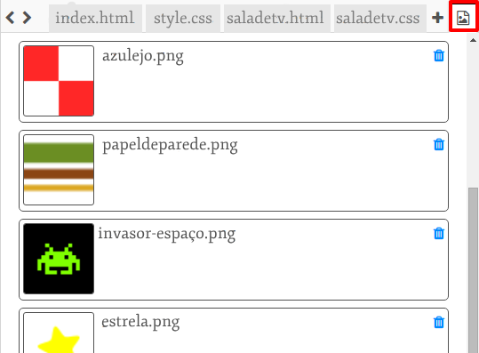

\--- challenge \---

## Desafio: Faça do seu jeito!

Adicione mais cômodos ao seu projeto. Lembre-se de que você pode usar **copiar** e **colar** para ganhar tempo e alterar apenas o que precisa ser diferente.

Para cada cômodo, você vai precisar:

+ Criar um arquivo `.html`
+ Adicionar links de portas para entrar e sair do novo ‘cômodo’
+ Criar um arquivo `.css` com os estilos do seu novo cômodo e de suas portas

Você pode alterar a cor de fundo `background-color:` de cada cômodo. Clique no ícone das imagens para ver as imagens de fundo disponíveis para escolha:

\--- /challenge \---