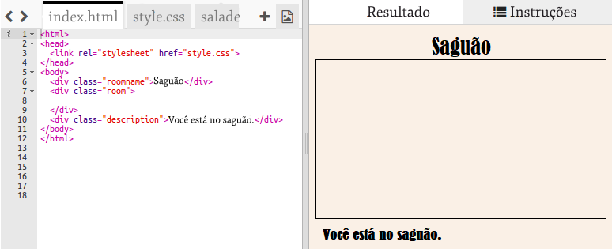
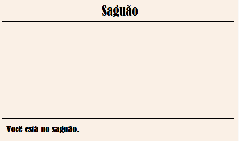
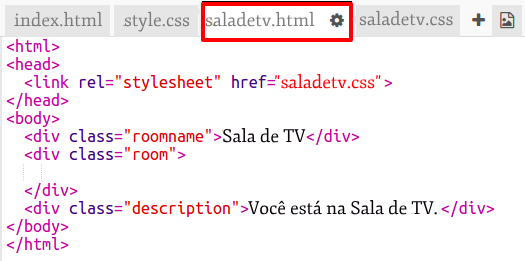
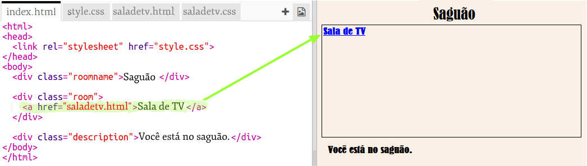
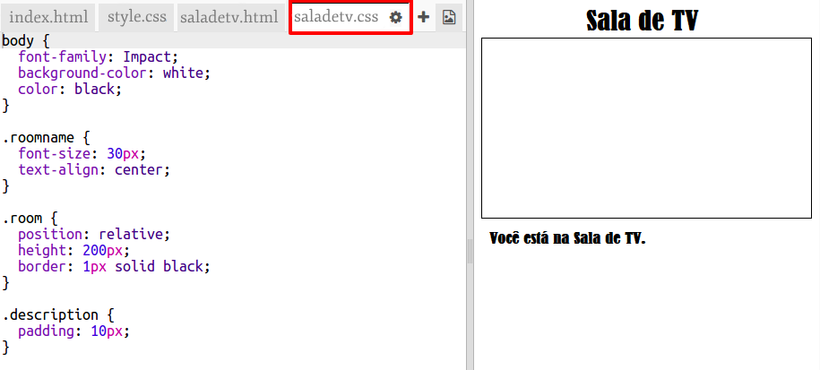

## Vinculando a outra página da Web no mesmo projeto

Os projetos da Web podem ser compostos de vários arquivos HTML vinculados.

+ Abra este trinket: <a href="https://trinket.io/html/496941882f" target="_blank">trinket.io/html/496941882f</a>.
    
    O projeto deverá ficar assim:
    
    

+ O trinket deve rodar automaticamente e você vai encontrar-se no corredor:
    
    

+ Veja a lista de guias de arquivos para este trinket. Você vê `saladetv.html`? Clique nele.
    
    
    
    Este é outro arquivo html no mesmo projeto.

+ Para chegar ao `saladetv.html` você precisa adicionar um link em `index.html`.
    
    Adicione o código destacado dentro do `
` com a sala `room (cômodo)`:
    
    

+ Teste seu trinket clicando no link **Sala de TV** para ver a `saladetv.html` página da Web.
    
    Veja que `saladetv.html` também tem seu próprio arquivo de estilo `saladetv.css` que define o layout para esta página.
    
    