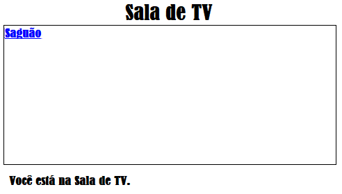

\--- desafio \---

## Desafio: adicione outro link

Adicione um link `<a>` à página da web  tvroom.html </ 1> para voltar à página da Sala, chamada <code> index.html </ 1>. O texto do link deve ser 'Sala'.

A página da Web TV Room deveria então ter um link clicável como este:

Certifique-se de testar seu código. Você deve poder se deslocar da Sala para a Sala de TV e voltar novamente clicando nos links.

--- / desafio ---
