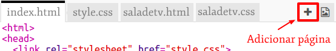
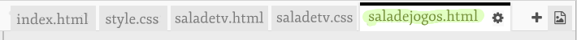
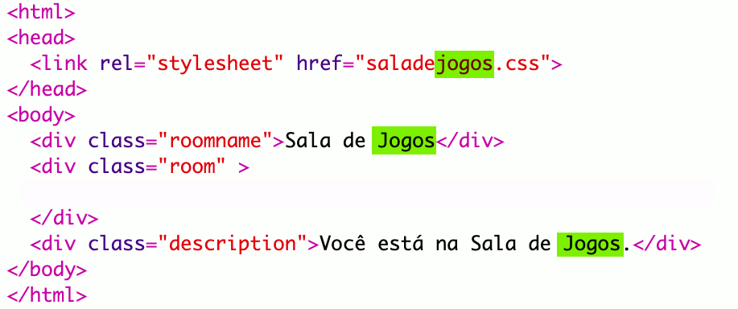
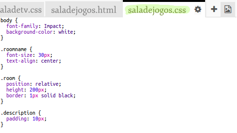
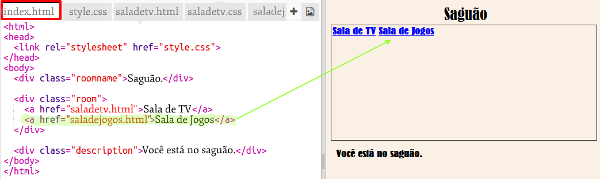

## Adicione outra sala

Agora vamos adicionar outra sala, uma **Sala de Jogos.**.

+ Clique no botão adicionar página **+**:
    
    
    
    Digite `saladejogos.html` como o nome da página:
    
    

+ O HTML da **Sala de Jogos** é muito parecido com o da `saladetv.html`, então **copie** aquele e **cole** em `saladejogos.html`.
    
    Edite os itens destacados para que eles digam Jogos e não TV:
    
    

+ Your `gamesroom.html` now uses `gamesroom.css` which doesn't exist yet.
    
    Crie `saladejogos.css` clicando no botão adicionar página **+**.

+ The CSS for the **Games Room** is very similar to `tvroom.css` so **copy** that and **paste** it into `gamesroom.css`.
    
    

+ Adicione um link do Saguão para a Sala de Jogos:
    
    

+ Teste seu projeto clicando no link da Sala de Jogos
    
    A **Sala de Jogos** deve ficar assim:
    
    
    
    Não é super emocionante, mas você pode resolver isso no próximo desafio.