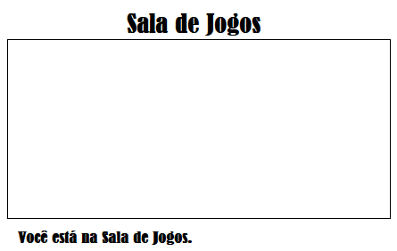

## Adicione outra sala

Agora vamos adicionar outra sala, uma **Sala de Jogos.**.

+ Clique no botão adicionar página **+**:
    
    
    
    Digite `saladejogos.html` como o nome da página:
    
    

+ O HTML da **Sala de Jogos** é muito parecido com o da `saladetv.html`, então **copie** aquele e **cole** em `saladejogos.html`.
    
    Edite os itens destacados para que eles digam Jogos e não TV:
    
    

+ Sua `saladejogos.html` agora usa o `saladejogos.css` que ainda não existe.
    
    Crie `saladejogos.css` clicando no botão adicionar página **+**.

+ O CSS da **Sala de Jogos** é muito parecido com o `saladetv.css`, então **copie ** e **cole** em `saladejogos.css`.
    
    

+ Adicione um link do Saguão para a Sala de Jogos:
    
    

+ Teste seu projeto clicando no link da Sala de Jogos
    
    A **Sala de Jogos** deve ficar assim:
    
    
    
    Não é super emocionante, mas você pode resolver isso no próximo desafio.