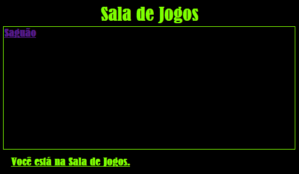

\--- challenge \---

## Desafio: Decore e interligue a sala de jogos

Edite o HTML e CSS para a ** Sala de Jogos ** para que a página fique assim:

Dica: Você precisará alterar a cor de fundo, a cor da fonte e a cor da borda em `saladejogos.css`. A cor verde brilhante se chama `chartreuse`.

Dica: Você precisará adicionar um `<a>` link em ` saladejogos.html ` que direciona para `index.html`.

\--- /challenge \---