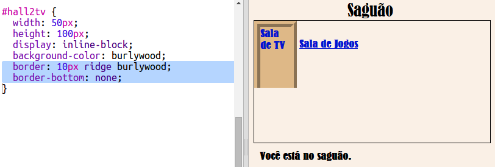

## Faça com que os links pareçam portas

Links não precisam ser apenas texto. Vamos fazer uma porta clicável usando um `
`.

+ Open `index.html` and add a `
` around the **TV Room** link text. Para torná-lo clicável, o texto precisa estar dentro do `<a>`.
    
    Add `id="hall2tv"` to label it as the door from the Hall to the TV Room so that you can style the door.
    
    

+ Clique na guia `style.css`, vá para o final e adicione o seguinte CSS para alterar o tamanho e a cor da porta:
    
    

+ Teste sua página web clicando em qualquer lugar na porta, não apenas no texto.

+ Agora vamos fazer parecer um pouco mais com uma porta, adicionando uma borda ao redor de três lados:
    
    

+ E vamos adicionar CSS para deixar o texto na porta com melhor aparência:
    
    

+ Você provavelmente já percebeu que a porta está flutuando no ar. Vamos consertar isso posicionando a porta dentro da sala.
    
    

+ Teste sua página web clicando na porta para chegar à **Sala de TV**.