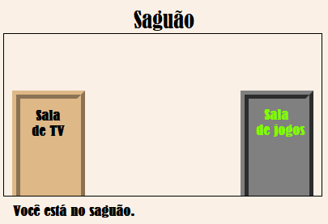
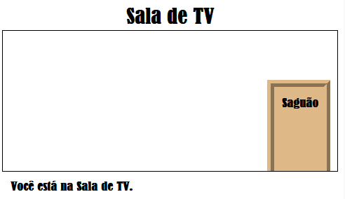

\--- desafio \---

## Desafio: adicione mais portas!

Transforme os outros links do seu projeto em portas da mesma maneira.

Para cada porta, você vai precisar:

+ Edite o link da porta para usar um `
` com um id semelhante a ` hall2games` para que você possa estilizá-lo.
    
    Por exemplo:
    
    `<a href="gamesroom.html">
Sala de Jogos
</a>`

+ Adicione o CSS do id da porta ao arquivo `.css` de sua sala. Use *copie* e *cole* para economizar tempo. Você pode fazer com que cada porta pareça diferente, se quiser.

+ Posicione a porta usando `parte inferior:` and `esquerda:` ou `direita:`.

O Salão deve aparecer assim:

A Sala de TV deve exibir algo do tipo:

\--- /challenge \---