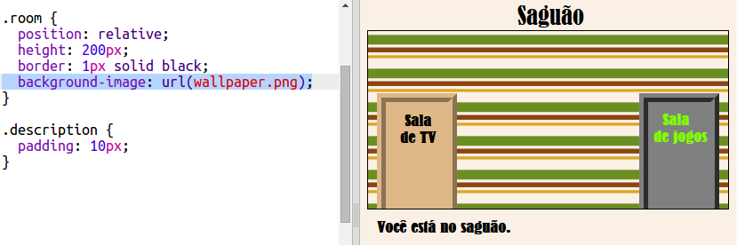

## Adicionando imagem de fundo

Vamos decorar a sala com uma imagem de fundo.

+ Edite o `style.css` para adicionar uma imagem de fundo a Sala:
    
    
    
    A imagem será repetida para preencher a sala inteira.