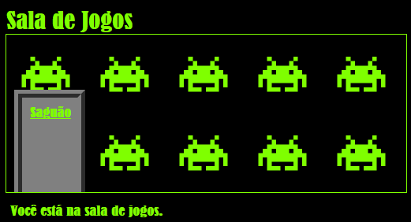

--- challenge ---

## Desafio: adicione papel de parede à Sala de Jogos

Você consegue decorar a sala de jogos com uma imagem de fundo?

Você pode usar a imagem de fundo `space-invader.png` que está incluída no seu projeto.

Você precisará de:

+ Adicionar uma `background-image:` ao arquivo CSS `.room` da Sala de Jogos. 

A sala decorada deve ficar assim:

--- /challenge ---