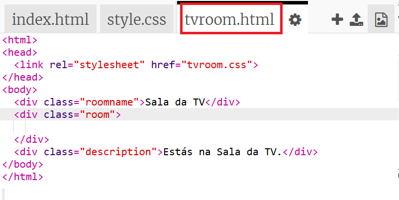
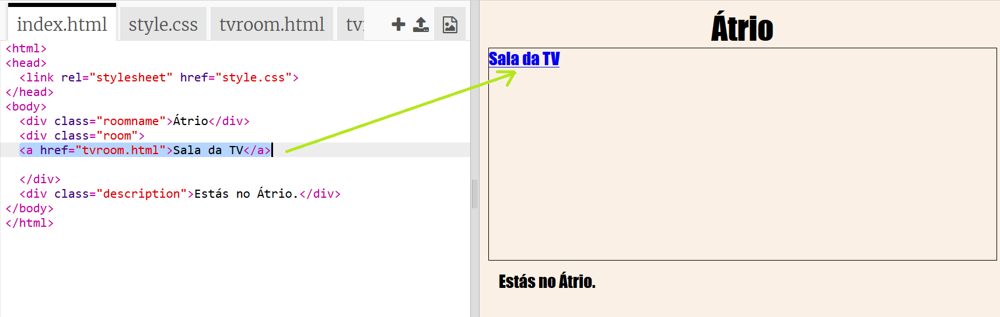
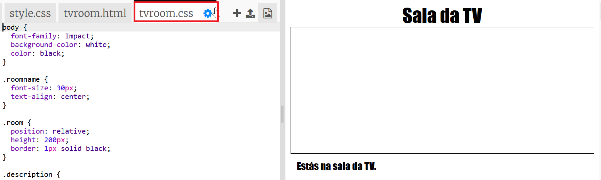

## Ligar a outra página web no mesmo projeto

Os projetos web podem ser constituídos por muitos ficheiros HTML ligados entre si.

+ Abre este trinket: <a href="https://trinket.io/html/f1486ddb24" target="_blank">jumpto.cc/web-rooms</a>.
    
    O projeto deverá ter este aspeto:
    
    

+ O trinket deve autoexecutar e encontrar-te-ás no Átrio:
    
    

+ Olha para a lista separadores de ficheiros para este trinket. Consegues ver o `tvroom.html`? Clica-lhe.
    
    
    
    Este é outro ficheiro HTML no mesmo projeto.

+ Para ir para o `tvroom.html` terás que acrescentar um link em `index.html`.
    
    Acrescenta o código destacado dentro da `sala` `
`com a turma</0>:
    
    

+ Experimenta o teu trinket clicando no link **Sala da TV** para ver a página `tvroom.html`.
    
    Nota que a página `tvroom.html` também tem o seu próprio ficheiro de estilo `tvroom.css` que define a disposição da página.
    
    