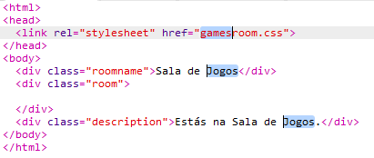

## Acrescentar outro quarto

Agora, vamos acrescentar outra sala, a **Sala dos Jogos**.

+ Clica no botão para acrescentar página **+**:
    
    
    
    Usa `gamesroom.html` como nome da página:
    
    

+ O HTML para a **Sala dos Jogos** é muito semelhante ao do `tvroom.html`, por isso **copia** e **cola** o código para o `gamesroom.html`.
    
    Edita os itens destacados de forma a que digam "Jogos" e não "TV":
    
    

+ O teu `gamesroom.html` agora utiliza o `gamesroom.css` que não existe ainda.
    
    Cria o `gamesroom.css` clicando no botão de acrescentar página **+**.

+ O CSS para a **Sala de Jogos** é muito semelhante ao do `tvroom.css`, por isso **copia** e depois **cola** o código para o `gamesroom.css`.
    
    

+ Acrescenta um link do Átrio para a Sala de Jogos:
    
    

+ Testa o teu projeto clicando no link da Sala de Jogos
    
    A **Sala de Jogos** deve ter este aspeto:
    
    
    
    Não é muito excitante, mas podem resolver isto no próximo desafio.