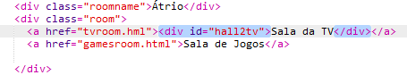

## Faz com que os links se pareçam com portas

Os links não têm que ter texto apenas. Vamos fazer uma porta clicável utilizando um `
`.

+ Abre o `index.html` e acrescenta um `
` à volta do texto do link **Sala da TV**. Tem que estar dentro do `<a>` para que seja clicável.
    
    Acrescenta `id="hall2tv"` para o classificar como a porta do Átrio para a Sala da TV de forma que consigas estilizar a porta.
    
    

+ Clica no separador `style.css`, vais para o final e acrescenta o seguinte CSS para alterar o tamanho e a cor da Porta:
    
    

+ Clica em qualquer lugar da porta para testar a tua página de internet, não apenas no texto.

+ Agora vamos fazer com que se pareça um pouco mais com uma porta ao acrescentar um limite em torno de três lados:
    
    

+ E vamos acrescentar algum CSS para fazer o texto na porta ter uma aspeto melhor:
    
    

+ Terás reparado provavelmente que a porta está como que a flutuar. Vamos corrigir este efeito posicionando a porta dentro do quarto.
    
    

+ Testa a tua página de internet clicando na porta para chegar à **Sala da TV**.