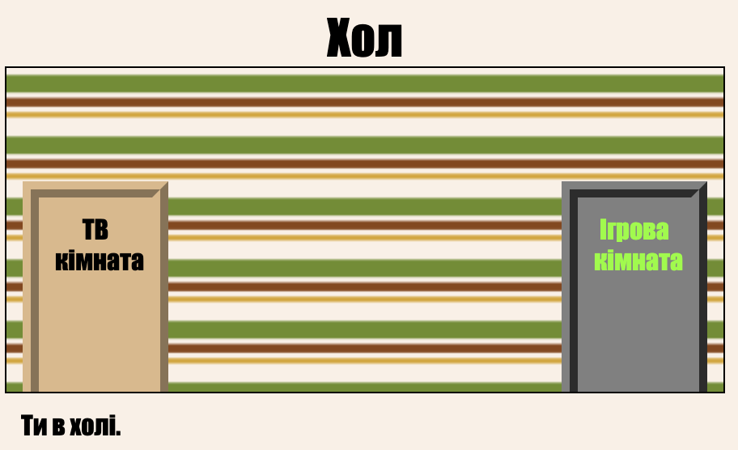

## Вступ

У цьому проекті ви створите набір пов'язаних номерів, де кожна кімната є іншою веб-сторінкою, яку ви можете прикрасити за допомогою HTML.

  <iframe src="https://trinket.io/embed/html/7be1c58741?outputOnly=true&start=result" width="600" height="450" frameborder="0" marginwidth="0" marginheight="0" allowfullscreen>
  </iframe>
  

**Вступ**: Натисніть на двері для переміщення між кімнатами.

### Додаткова інформація для лідерів клубу

Якщо вам потрібно роздрукувати цей проект, скористайтеся [Версія для друку](https://projects.raspberrypi.org/uk-UA/projects/linked-rooms/print).

--- collapse ---
---
title: Нотатки керівників клубу
---
## Вступ:

У цьому проекті діти познайомилися з кількома пов'язаними веб-сторінками в одному проекті, кожна з яких має власний CSS-файл.

## Інтернет-ресурси

Ми рекомендуємо використовувати [trinket](https://trinket.io/), щоб написати HTML & CSS онлайн. Цей проект містить такий trinket:

* [Відправна точка "пов'язаних номерів"-- jumpto.cc/web-rooms](https://trinket.io/html/50cb5da6ca)

Діти також можуть скористатися цим порожнім trinket [(jumpto.cc / html-blank)](http://jumpto.cc/html-blank), щоб написати свій власний HTML & CSS, або ж вони можуть використовувати цей шаблон trinket [(jumpto.cc/html-template)](http://jumpto.cc/html-template).

Існує також trinket, що містить вибіркове рішення для вирішення проблем:

* ["Пов'язані кімнати завершено"-- https://trinket.io/html/7be1c58741](https://trinket.io/html/7be1c58741)

## Оффлайн ресурси

Цей проект може бути [завершено оффлайн](https://www.codeclubprojects.org/en-GB/resources/webdev-working-offline/), якщо це є бажаним. Ви можете отримати доступ до ресурсів проекту, натиснувши посилання "Матеріали проекту" для цього проекту. Це посилання містить розділ "Ресурси проекту", який включає в себе ресурси, необхідні для завершення цього проекту в режимі оффлайн. Переконайтеся, що кожна дитина має доступ до копії цих ресурсів. Цей розділ містить наступні файли:

* linked-rooms/index.html
* linked-rooms/style.css
* linked-rooms/script.js
* linked-rooms/prefixfree.js
* linked-rooms/4 x .png images
* template/template.html
* template/style.css

Ви також можете знайти завершену версію цього проекту у розділі "Ресурси волонтерів", яка містить:

* linked-rooms-finished/index.html
* linked-rooms-finished/style.css
* linked-rooms-finished/script.js
* linked-rooms-finished/prefixfree.js
* linked-rooms-finished/4 x .png images

(Усі вищезазначені ресурси також можна завантажувати як проектні та добровільні файли `.zip`.)

## Мета навчання

* Цей проект представляє проекти з декількома Html-сторінками, з'єднаними між собою
* Кілька CSS-файлів також введено

Цей проект охоплює елементи з наступних напрямків навчального плану [Raspberry Pi Digital Making Curriculum](http://rpf.io/curriculum):

* [Розробіть основні 2D та 3D атрибути](https://www.raspberrypi.org/curriculum/design/creator).

## Виклики

* "Додати інше посилання" - Додати посилання між сторінками одного і того ж проекту;
* “Стиль та посилання на Ігрову кімнату”-- Додати посилання та створити сторінку з власним CSS-файлом. 
* "Додати більше дверей!" - Використовуйте 
 s як налаштовувані посилання
* "Додати шпалери в ігрову кімнату" - Додати фонове зображення
* "Зробіть це своїм!" - Додати більше кімнат, використовуючи набуті навички 
* "Додати ключовий курсор" - веселе додаткове додаткове для тих, хто завершує проект

--- /collapse ---

--- collapse ---
---
title: Матеріали проекту
---
## Ресурси проекту

* [.zip-файл, що містить всі ресурси проекту](resources/rooms-project-resources.zip)
* [Інтернет-брелок з усіма ресурсами проекту "Зв'язані кімнати"](https://trinket.io/html/50cb5da6ca)
* [Шаблон онлайн-брелок](http://jumpto.cc/trinket-template)
* [Онлайн чистий брелок](http://jumpto.cc/trinket-blank)
* [template/index.html](resources/template-index.html)
* [template/style.css](resources/template-style.css)
* [linked-rooms/index.html](resources/linked-rooms-index.html)
* [linked-rooms/style.css](resources/linked-rooms-style.css)
* [linked-rooms/tvroom.html](resources/linked-rooms-tvroom.html)
* [linked-rooms/tvroom.css](resources/linked-rooms-tvroom.css)
* [linked-rooms/wallpaper.png](resources/linked-rooms-wallpaper.png)
* [linked-rooms/space-invader.png](resources/linked-rooms-space-invader.png)
* [linked-rooms/tiles.png](resources/linked-rooms-tiles.png)
* [linked-rooms/star.png](resources/linked-rooms-star.png)
* [linked-rooms/stripes.png](resources/linked-rooms-stripes.png)

## Ресурси лідерів клубу

* [.zip file containing all completed project resources](resources/rooms-volunteer-resources.zip)
* [Онлайн завершений проект Trinket](https://trinket.io/html/7be1c58741)
* [linked-rooms-finished/index.html](resources/linked-rooms-finished-index.html)
* [linked-rooms-finished/style.css](resources/linked-rooms-finished-style.css)
* [linked-rooms-finished/tvroom.html](resources/linked-rooms-finished-tvroom.html)
* [linked-rooms-finished/tvroom.css](resources/linked-rooms-finished-tvroom.css)
* [linked-rooms-finished/gamesroom.html](resources/linked-rooms-finished-gamesroom.html)
* [linked-rooms-finished/gamesroom.css](resources/linked-rooms-finished-gamesroom.css)
* [linked-rooms-finished/wallpaper.png](resources/linked-rooms-finished-wallpaper.png)
* [linked-rooms-finished/space-invader.png](resources/linked-rooms-finished-space-invader.png)
* [linked-rooms-finished/tiles.png](resources/linked-rooms-finished-tiles.png)
* [linked-rooms-finished/star.png](resources/linked-rooms-finished-star.png)
* [linked-rooms-finished/stripes.png](resources/linked-rooms-finished-stripes.png)

--- /collapse ---