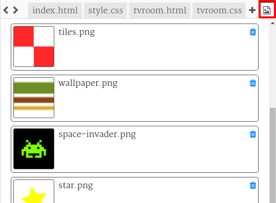

\--- challenge \---

## Виклик: зробити це твоїм!

Додати більше кімнат до вашого проекту. Пам'ятайте, що ви можете використовувати ** копіювати ** та ** вставити **, щоб заощадити час, а потім просто змінити речі, які мають бути різними.

Для кожної кімнати вам знадобиться:

+ Створіть файл `.html `
+ Додайте посилання до дверей до і з нової "кімнати"
+ Створіть файл `.css ` із стилями для своєї нової кімнати та її дверей

Ви можете змінити ` фоновий колір: ` для кожної кімнати. Натисніть на значок зображення, щоб побачити фонові зображення, які ви можете вибрати:

\--- /challenge \---