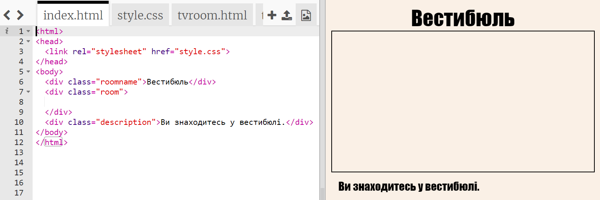
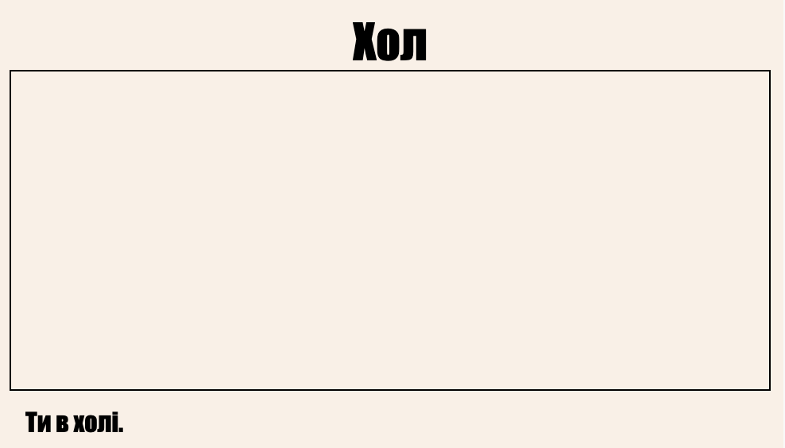
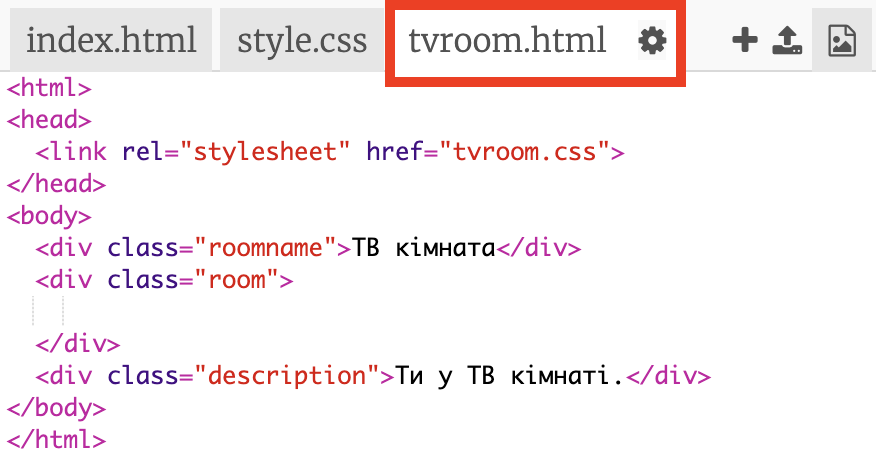
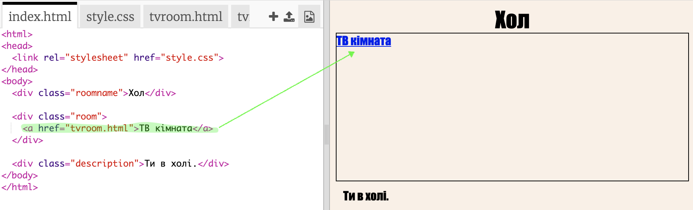
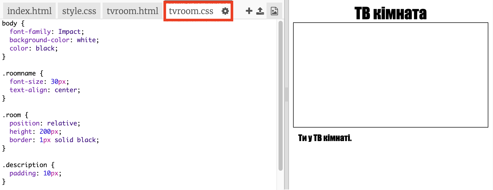

## Посилання на іншу веб-сторінку в одному проекті

Веб-проекти можуть складатися з безлічі HTML-файлів, з'єднаних між собою.

+ Відкрийте цей Trinket: <a href="http://jumpto.cc/web-rooms" target="_blank">jumpto.cc/web-rooms</a>.
    
    Проект повинен виглядати так:
    
    

+ Trinket має автозапуск, і ви опинитеся в Залі:
    
    

+ Подивіться список вкладок файлів для цього Trinket. Ви бачите `tvroom.html`? Натисніть на це.
    
    
    
    Це ще один html-файл у тому ж проекті.

+ Щоб перейти до `tvroom.html`, потрібно додати посилання `index.html`.
    
    Додайте виділений код всередині `
` з класом `кімната`:
    
    

+ Перевірте свій Trinket, натиснувши посилання **TV кімната**,щоб переглянути веб-сторінку `tvroom.html`.
    
    Зверніть увагу, що `tvroom.html` також має свій власний файл `tvroom.css`, який визначає макет цієї сторінки.
    
    