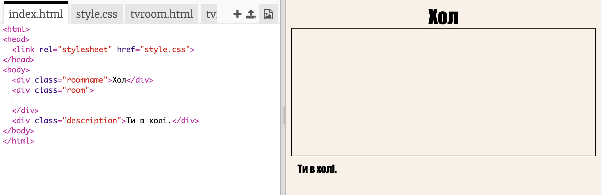

## Посилання на іншу вебсторінку в цьому ж проєкті

Вебпроєкти можуть складатися з безлічі HTML-файлів, з'єднаних між собою.

+ Відкрий цей проєкт trinket: <a href="https://trinket.io/html/f1486ddb24" target="_blank">jumpto.cc/web-rooms</a>.
    
    Проєкт повинен виглядати так:
    
    

+ Цей проєкт trinket має автозапуск, тому ти зразу опинишся в холі:
    
    

+ Подивися на список вкладок файлів для цього проєкта trinket. Ти бачиш `tvroom.html`? Натисни на неї.
    
    
    
    Це ще один html-файл у тому ж проєкті.

+ Щоб перейти до `tvroom.html`, потрібно додати відповідне посилання в `index.html`.
    
    Додай виділений код всередину `
` з класом `room`:
    
    

+ Перевір свій trinket, натиснувши посилання **ТВ кімната**, щоб побачити вебсторінку `tvroom.html`.
    
    Зверни увагу, що `tvroom.html` також має свій власний файл `tvroom.css`, який визначає вигляд цієї сторінки.
    
    