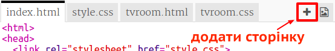
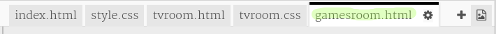
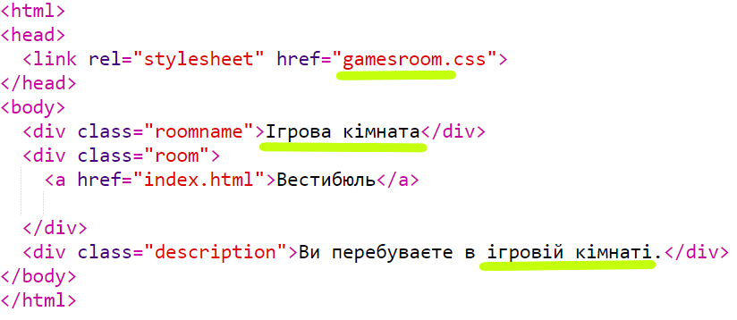
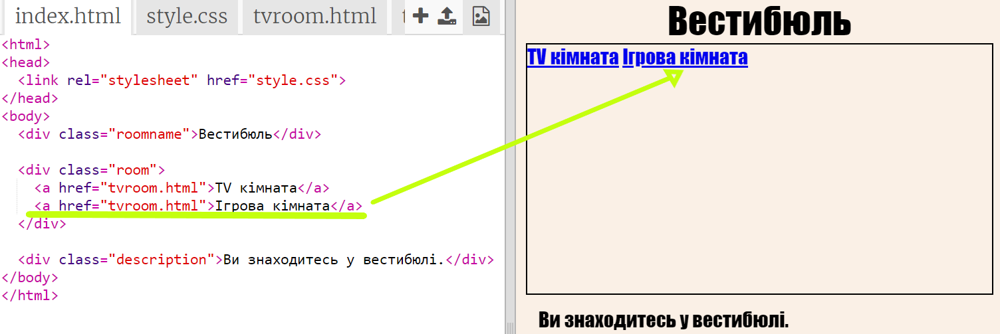
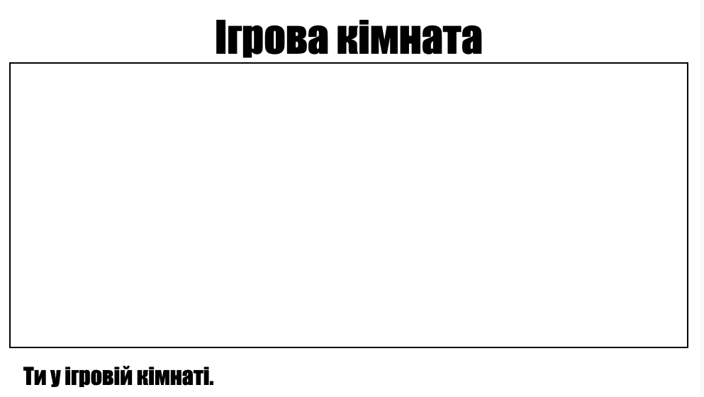

## Додати ще одну кімнату

Тепер давайте додамо ще одну кімнату ** Ігрова кімната **.

+ Натисніть кнопку додати сторінку ** + **:
    
    
    
    Введіть ` gamesroom.html ` як ім'я сторінки:
    
    

+ HTML ** Ігрова кімната ** дуже схожа на ` tvroom.html `, тому ** скопіюйте ** та ** вставте ** в ` gamesroom.html `.
    
    Редагувати виділені елементи, щоб вони говорили Ігри не TV:
    
    

+ У вашому ` gamesroom.html ` тепер використовується ` gamesroom.css `, який ще не існує.
    
    Створіть ` gamesroom.css `, натиснувши кнопку додавання сторінки ** + **.

+ CSS для кімнати ** Ігрова Кімната ** дуже схожий на ` tvroom.css `, тому ** скопіюйте **, а ** вставте ** в <1 > gamesroom.css </code>.
    
    

+ Додайте посилання з Залі на Ігрову кімнату:
    
    

+ Перевірте свій проект, натиснувши посилання Ігрова кімната
    
    ** Ігрова кімната ** має виглядати наступним чином:
    
    
    
    Не дуже захоплююче, але ви можете виправити це в наступному виклику.