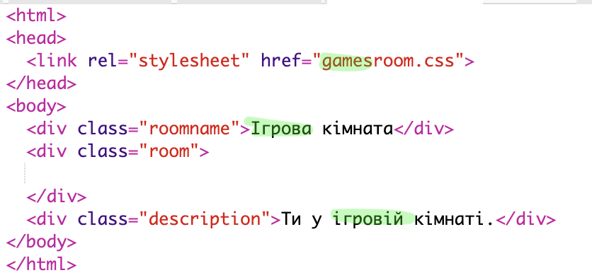
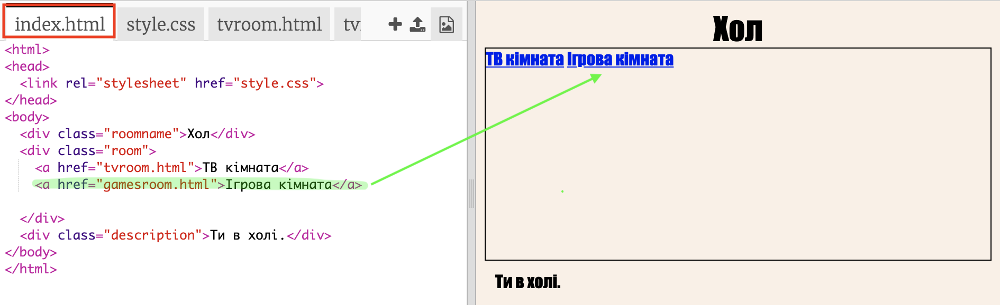

## Додати ще одну кімнату

Тепер давай додамо ще одну кімнату **Ігрова кімната**.

+ Натисни кнопку додавання сторінки **+**:
    
    
    
    Введи `gamesroom.html` як ім'я сторінки:
    
    

+ HTML-код для сторінки **Ігрова кімната** дуже схожий на `tvroom.html`, тому **скопіюй** та **встав** його в `gamesroom.html`.
    
    Відредагуй виділені елементи, щоб вони містили Ігрова/games а не ТВ/tv:
    
    

+ Зараз твій файл `gamesroom.html` використовує `gamesroom.css`, який ще не існує.
    
    Створи `gamesroom.css`, натиснувши кнопку додавання сторінки **+**.

+ CSS-код для **Ігрової кімнати** дуже схожий на `tvroom.css`, тому **скопіюй**, а **встав** його в `gamesroom.css`.
    
    

+ Додай посилання із Холу на Ігрову кімнату:
    
    

+ Перевір свій проєкт, натиснувши посилання Ігрова кімната
    
    **Ігрова кімната** має виглядати наступним чином:
    
    
    
    Не дуже захоплююче, але ти можеш виправити це в наступному завданні.