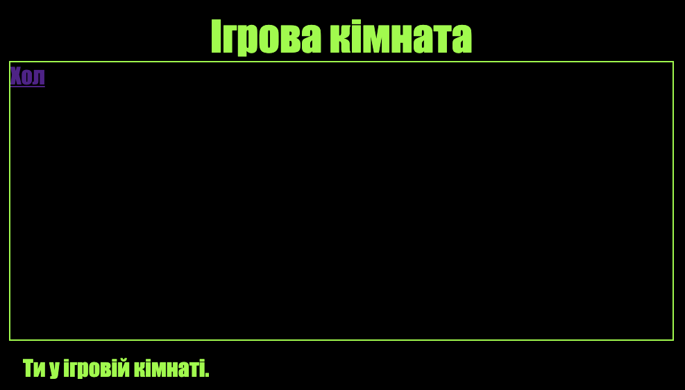

\--- challenge \---

## Завдання: стиль і посилання для ігрової кімнати

Відредагуй код HTML та CSS для **Ігрової кімнати**, щоб вебсторінка виглядала так:

Підказка: тобі потрібно буде змінити колір фону (background-color), колір шрифту (color) та колір контура (border) в `gamesroom.css`. Яскраво-зелений колір називається `chartreuse`.

Підказка: тобі потрібно буде додати посилання `<a>` в `gamesroom.html`, що вказує на `index.html`.

\--- /challenge \---