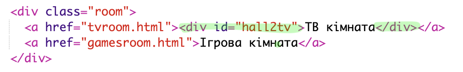
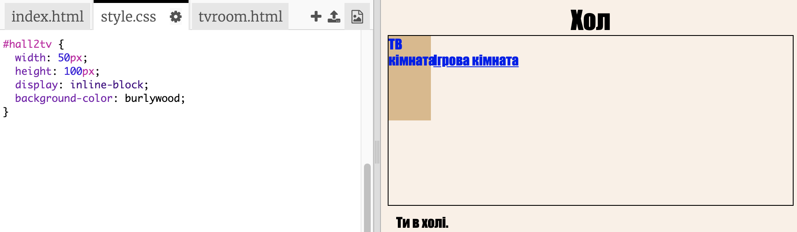
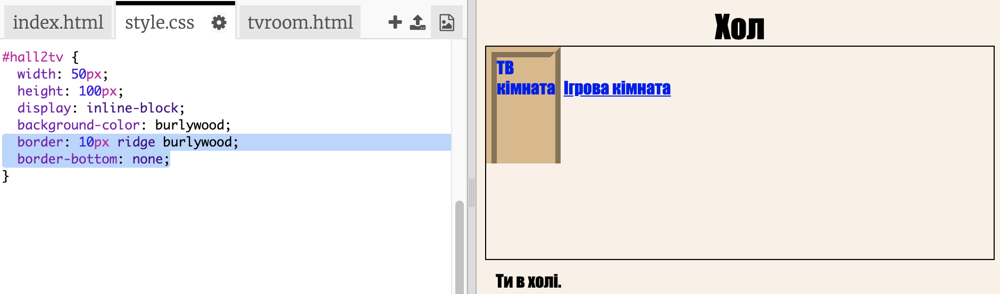
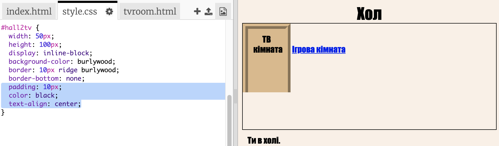
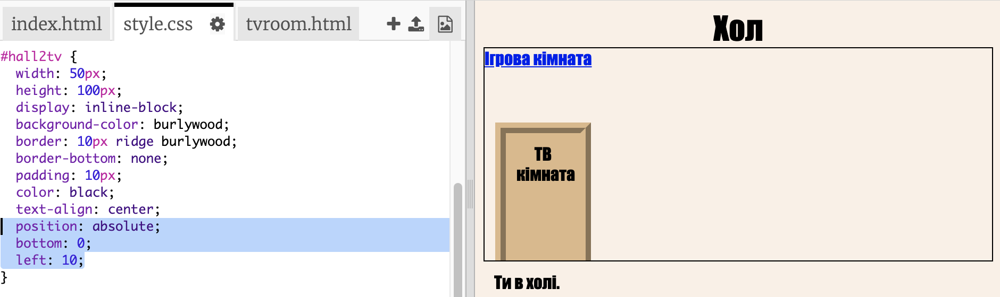

## Зробіть посилання, що виглядають як двері

Посилання мають бути не просто текстовими. Давайте зробимо клікабельні двері, використовуючи `
`.

+ Відкрийте `index.html` і додайте `
` текст посилання **TV Кімната**. Вона повинна бути всередині `<a>`, щоб зробити її доступною для натискання.
    
    Додати `id="hall2tv"`, щоб позначити його як двері від вестибюлю до TV кімнати, щоб ви могли стилізувати двері.
    
    

+ Натисніть на вкладку `style.css`, перейдіть донизу та додайте наступний CSS, щоб змінити розмір і колір дверей:
    
    

+ Перевірте свою веб-сторінку, натиснувши будь-яку точку доступу, а не тільки текст.

+ Тепер давайте зробимо це трохи більше схожим на двері, додавши кордон з трьох сторін:
    
    

+ І давайте додамо деякі CSS, щоб текст виглядав краще:
    
    

+ Ви, напевно, помітили, що двері літають в повітрі. Давайте встановимо їх, розмістивши двері усередині кімнати.
    
    

+ Перевірте свою веб-сторінку, натиснувши двері, щоб перейти до **TV Кімната**.