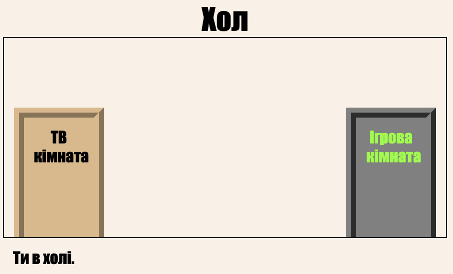

\--- challenge \---

## Виклик: Додати більше дверей!

Перетворіть інші посилання у вашому проекті на двері таким же чином.

Для кожної двері вам потрібно:

+ Редагувати посилання на двері, щоб використовувати `
` з такими ідентифікаторами, як ` hall2games `, щоб ви могли його створити.
    
    Наприклад:
    
    `<a href="gamesroom.html">
 Ігрова кімната 
</a>`

+ Додайте CSS для ідентифікатора дверей у файл `.css ` для своєї кімнати. Використовуйте * копіювати * та * вставити *, щоб заощадити час. Ви можете зробити кожні двері виглядати по-іншому, якщо вам подобається.

+ Поставте двері, використовуючи ` нижню частину: ` та ` зліва: ` або ` праворуч: `.

Зал може виглядати так:

Телевізійна кімната повинна виглядати приблизно так:

\--- /challenge \---