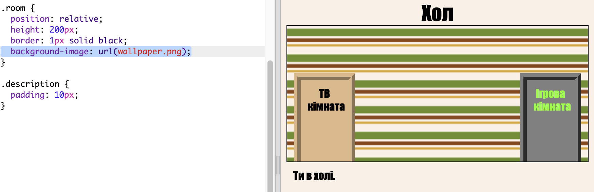

## Додавання фонового зображення

Прикрасьте залу фоновим зображенням.

+ Редагувати `style.css`, щоб додати фонове зображення в зал:
    
    
    
    Зображення буде повторено, щоб заповнити всю кімнату.