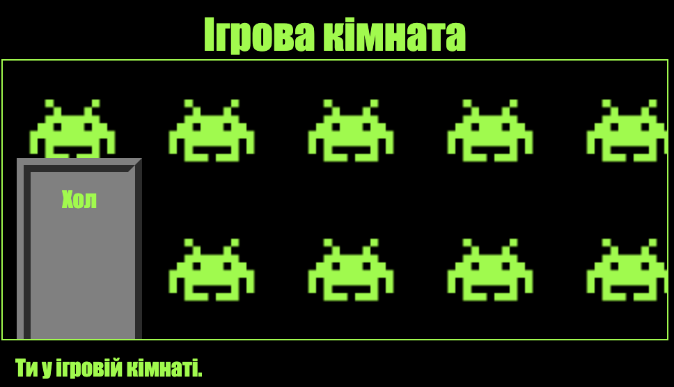

\--- challenge \---

## Завдання: додавання шпалер в Ігрову кімнату

Чи можеш ти прикрасити ігрову кімнату фоновим зображенням?

Ти можеш використати фонове зображення `space-invader.png`, яке входить до твого проєкту.

Тобі потрібно буде:

+ Додати `background-image:` (фонове зображення) в код CSS `.room` для Ігрової кімнати. 

Прикрашена кімната повинна виглядати так:

\--- /challenge \---